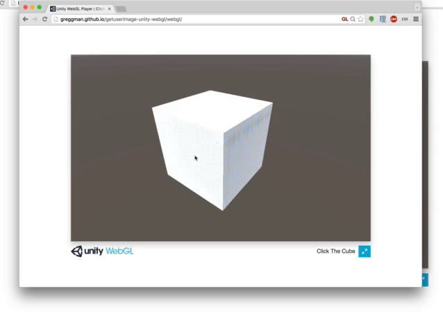

Example of Unity-WebGL asking the user for an image
===================================================

[You can see it live here](http://greggman.github.io/getuserimage-unity-webgl/webgl/).

And [here's a .unitypackage](https://github.com/greggman/getuserimage-unity-webgl/releases/download/v0.0.2/GetImageFromUser.unitypackage).

